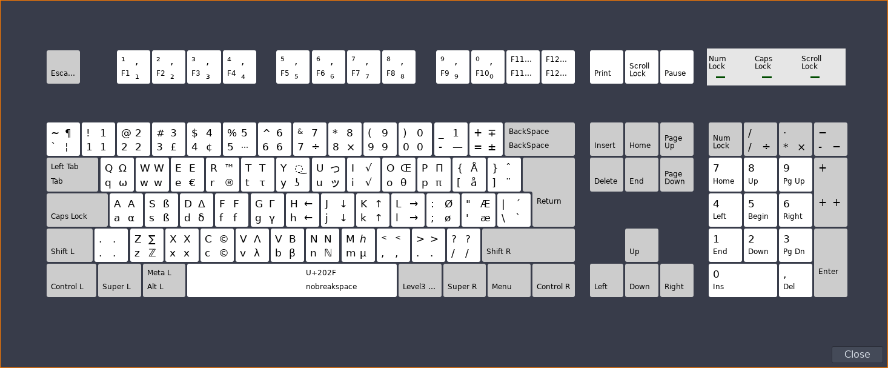

# moved to [https://git.sr.ht/~jole/nous](https://git.sr.ht/~jole/nous)
# NUSS - The ultimate programming keyboard
Nordic + United States + Special\
Made with scandinavian keyboards in mind. Uses both Shift and AltGr to switch keys.\
PRs for general improvements and localizations for other countries are of course welcome :)

# Installation
```sh
# cp nuss /usr/share/X11/xkb/symbols
$ setxkbmap nuss
```
For a permanent setup:
```sh
#/etc/X11/xorg.conf.d/00-keyboard.conf
Section "InputClass"
        Identifier "system-keyboard"
        MatchIsKeyboard "on"
        Option "XkbLayout" "nuss"
        Option "XkbModel" "pc102"
	Option "XkbOptions" "altwin:swap_lalt_lwin"
EndSection
```

# Preview

As you can see it also has some mathematical symbols, too.\
NOTE: AltGr+5 gives ‰ (per mille / promille), it is shortened to ... in the image.

# TODO
* Shift+AltGr+FX → 1/2 etc
* More mathematical symbols like R and Q
* Utilize the key between Shift and Z (but for what?)
* Swap ESC and CapsLock
* Utilize key between FN and Ctrl for something other than "right clicking"
